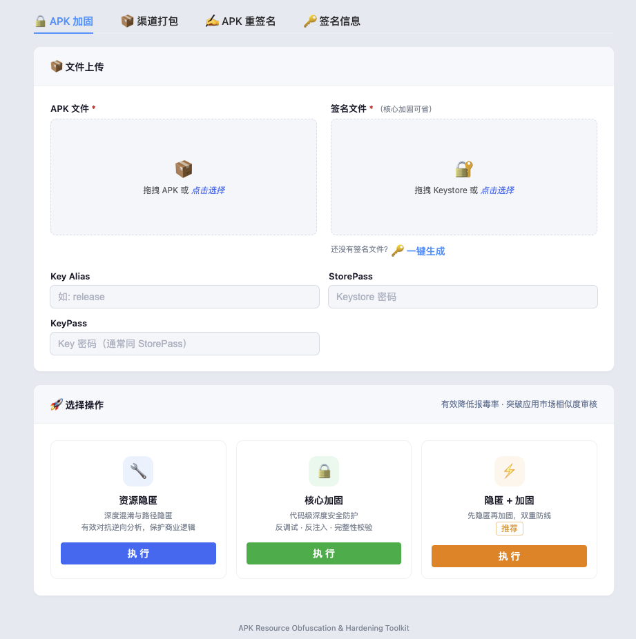
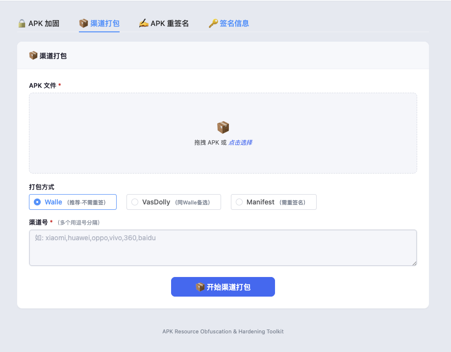
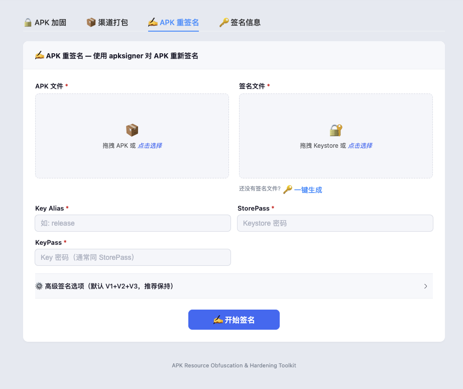
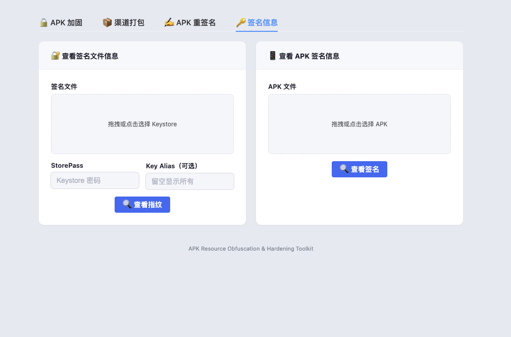

# 🛡️ Android Packer

**企业级 Android APK 加固 · 资源混淆 · 多渠道打包 · 一体化解决方案**


---

## 📖 目录

- [🔥 核心能力](#-核心能力)
- [🛡️ 报毒对抗体系](#️-报毒对抗体系)
- [🏪 应用市场上架保障](#-应用市场上架保障)
- [📦 多渠道打包](#-多渠道打包)
- [🏗️ 技术架构](#️-技术架构)
- [🚀 快速开始](#-快速开始)
- [📸 管理后台](#-管理后台)
- [📞 联系方式](#-联系方式)

---

## 🔥 核心能力

### 📱 资源混淆

资源路径缩短、文件名随机化、资源隐藏 —— 有效对抗逆向分析与资源剽窃。

### 🔐 代码加固

DEX 加密 + SO 库加固 + 壳注入，三层防护确保核心逻辑不可逆。

### 🛡️ 运行时保护

8 层运行时防护：反调试、反 Frida、反 Xposed、反 Hook、模拟器检测、完整性校验、Merkle 哈希树。

### 🌐 Web 可视化操作

直观的 Web 管理后台 + 完整的 REST API，一键完成加固、签名、多渠道打包。

---

## 🛡️ 报毒对抗体系

内置 **六层** 报毒与相似度解决方案，从根本上消除 *"同一壳被多 App 共用导致相似度 > 80%"* 的报毒根因。

### ① 壳代码全链路随机化

每次加固生成**指纹完全不同的壳**，杜绝批量报毒：

- **Smali 层**：包名 / 类名 / 方法名随机化
- **Native 层**：SO 导出符号与字符串表混淆
- **清单层**：注入组件名随机化、Assets 文件指纹优化

### ② 策略分级

按渠道裁剪保护项，避免过度加固触发误报：

| 策略 | 适用场景 | 保护内容 |
|------|---------|---------|
| `minimal` | Google Play | 仅资源混淆，不注入壳 |
| `standard` | 国内大厂应用市场 | 资源混淆 + 轻量 DEX 加密，跳过反调试 |
| `maximum` | 第三方下载站 | 全保护开启 |

### ③ VirusTotal 发版前扫描

自动对接 VirusTotal API，报毒引擎 ≥ 3 阻断发布流水线，配合 360 / 腾讯 / 华为 / 小米等主流安全厂商白名单申诉通道。

### ④ 签名合规

正式证书 + V1 + V2 + V3 全量签名，杜绝 Debug 签名出厂。

---

## 🏪 应用市场上架保障

针对 **华为、小米、OPPO、vivo、Google Play** 等主流市场差异化审核策略，在保护强度与上架成功率间取得最佳平衡：

- ✅ 资源混淆 + ProGuard/R8 代码混淆 + 轻量 DEX 加密 → **相似度检测 < 40%，一次过审**
- ✅ 随机壳变体杜绝多 App 代码指纹雷同
- ✅ 多渠道签名隔离，防止证书污染扩散
- ✅ 配套各市场误报申诉 SOP
- ✅ 自动化 CI/CD 加固流水线

---

## 📦 多渠道打包

支持三种渠道注入方式，加固阶段一步完成：

| 方式 | 特点 |
|------|------|
| **Walle** | 新一代 APK 渠道包方案，毫秒级写入 |
| **VasDolly** | 基于 V2/V3 签名的渠道注入 |
| **Manifest meta-data** | 传统清单注入，兼容性最佳 |

---

## 🏗️ 技术架构

```
┌─────────────────────────────────────────┐
│              Web 管理后台                  │
│          Vue 3 + Element Plus            │
├─────────────────────────────────────────┤
│              REST API 层                  │
│          FastAPI + Pydantic              │
├─────────────────────────────────────────┤
│              加固引擎                     │
│  ┌─────────┬──────────┬──────────────┐   │
│  │ 资源混淆 │  DEX 加密 │ SO 库加固    │   │
│  ├─────────┼──────────┼──────────────┤   │
│  │ 壳注入   │  运行时保护 │ 签名与渠道  │   │
│  └─────────┴──────────┴──────────────┘   │
└─────────────────────────────────────────┘
```

---

## 🚀 快速开始

### 环境要求

- Python 3.10+
- Node.js 18+
- Android SDK（可选，离线签名场景）

### 一键部署

```bash
# 克隆仓库
git clone https://github.com/your-org/android-packer.git
cd android-packer

# 后端服务
pip install -r requirements.txt
python main.py

# 前端管理后台
cd web
npm install && npm run dev
```

访问 `http://localhost:8000` 进入管理后台。

### CI/CD 集成

```yaml
# GitHub Actions 示例
- name: APK 加固
  run: |
    curl -X POST http://your-server:8000/api/pack \
      -F "apk=@app-release.apk" \
      -F "strategy=standard" \
      -F "channel=huawei" \
      -o app-protected.apk
```

---

## 📸 管理后台

| 加固操作 | 多渠道打包 |
|:---:|:---:|
|  |  |

| APK 签名 | 签名信息查看 |
|:---:|:---:|
|  |  |

---

## 📞 联系方式

- **Telegram**：[@apk_gongfang](https://t.me/apk_gongfang)

---

*Made with ❤️ for the Android security community*
